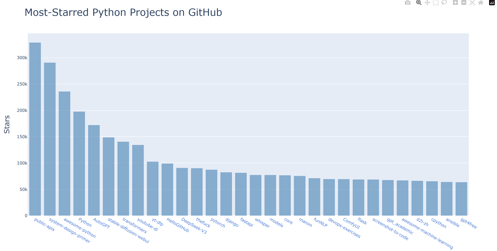

# GitHub Python Repositories Explorer

This project fetches and displays information about Python repositories on GitHub with over 10,000 stars. It includes a Python script to interact with the GitHub API and a pytest test suite to validate the functionality.

## Features
- API Integration: Fetches repository data from GitHub's search API.
- Repository Insights: Displays key details like name, owner, stars, URL, and description.
- Testing Suite: Validates API response status, data completeness, and repository criteria.

## Prerequisites
- Python 3.7+
- requests library (for API calls)
- pytest (for running tests)

## Installation
1. Clone the Repository
```bash
git clone https://github.com/pablo727/python_API_-_test.git
cd python_API_-_test
```
2. Install Dependencies
```bash
pip install requests pytest
```

## Project Structure
```py
python_API_-_test/
├── python_repos_visual.py       # Main script to fetch and display repository data
├── test_python_repos.py         # Test suite for validating the script's functionality
└── README.md                    # Project documentation
```

## Usage
### Fetch Repository Data
Run the script to see information about top Python repositories:
```bash
python python_repos_visual.py
```
Sample Output:
```bash
Status code: 200
Total repositories: 284
Complete results: True
Repositories returned: 30

Selected information about each repository:
Name: awesome-python
Owner: vinta
Stars: 163805
Repository: https://github.com/vinta/awesome-python
Description: A curated list of awesome Python frameworks, libraries, software and resources...
...
```
### Run Tests
Execute the test suite to verify functionality:
```bash
pytest test_python_repos.py -v
```
Sample Test Output:
```py
============================= test session starts ==============================
collected 3 items

test_python_repos.py::test_response_status_code PASSED                   [ 33%]
test_python_repos.py::test_get_response_dict PASSED                      [ 66%]
test_python_repos.py::test_repo_dicts PASSED                              [100%]

============================== 3 passed in 2.12s ===============================
```

## Testing Details
The test suite includes:
Status Code Check: Ensures the API returns a 200 OK response.
Response Validation: Confirms the total repositories exceed 240 and results are complete.=
Data Integrity: Verifies all returned repositories have over 10,000 stars.Testing Details

## Notes
- GitHub API Rate Limits: The script uses unauthenticated requests, which are limited to 60 requests per hour. If you hit limits, consider adding authentication.

- Repository criteria (stars > 10k) are hardcoded in the API URL. Adjust the query in python_repos_visual.py if needed.

## License

This project is licensed under the [MIT License](https://opensource.org/licenses/MIT). See LICENSE for details.
--
Author: Pablo Rodriguez
Acknowledgments: GitHub API for providing repository data.
--
### How to Add the README to Your Repository
1. Create a new file named README.md in your project folder.
2. Copy and paste the content above into the file.
3. Save the file.
4. Commit and push it to GitHub:
```bash
git add README.md
git commit -m "Add README file"
git push origin main
```


